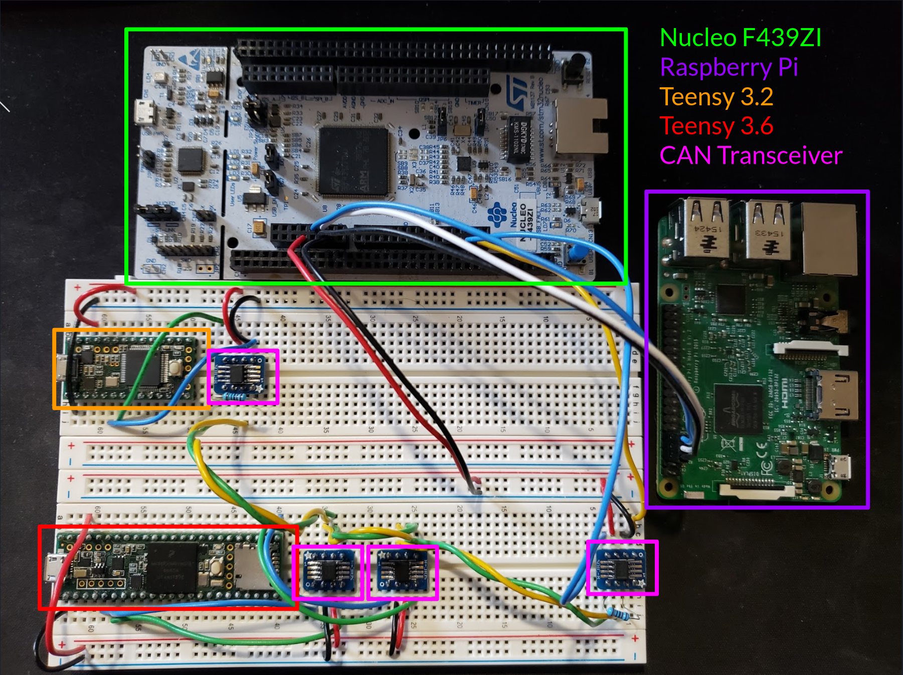
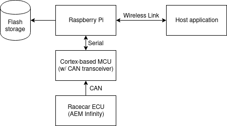

## M202A Project

### Useful Links

- [Project Repo](https://github.com/rahulsalvi/M202A_Project) - follow the
  README for instructions on cloning and potentially building (although running
  will require the same hardware which I have)
- [Project Presentation](https://www.youtube.com/watch?v=Euvlaq-4Kus&feature=youtu.be)

### Motivation

Motivated by work building racecars for the Formula SAE student competition, I
want to develop a data logging system that can be used onboard a vehicle. The
system will monitor the vehicle's CANbus and log messages to non-volatile
storage for later consumption. In practice, realtime telemetry is often useful
for quickly diagnosing issues on the racecar. To facilitate this, a host
application running on a ordinary laptop will be created. The application will
establish a wireless connection (either bluetooth or WiFi) to the data logger
to stream and visualize data immediately. During testing, the vehicle passes
through a course much larger than the range of a bluetooth or WiFi network, so
the connection will obviously drop. A form of *delay-tolerant networking* will
be implemented to handle connection issues. The data logger will recognize that
the connection has been dropped and wait until it is re-established. At this
point, it can stream data that was missed back to the host.

### Technical Approach

#### Hardware

##### Hardware Used

- Raspberry Pi 3
- STM32 Nucleo F439ZI
- Teensy 3.6
- Teensy 3.2
- Several SN65HVD232 CAN Transceivers

##### Explanation

The hardware for the datalogger itself consists of a Raspberry Pi 3 paired with
an STM32 Nucleo F439ZI microcontroller board. The Nucleo board was chosen for
convenience and is more powerful than what is required by the application. STM32
is a common platform, so there is significant community and first-party support.
This makes it easy to quickly develop applications. The Raspberry Pi was chosen
for similar reasons. In addition, the Raspberry Pi runs a full operating system
with a modern filesystem, making it more robust for use on the dynamic
environment of a racecar. The Raspberry Pi also has on-board wireless in the
form of WiFi and Bluetooth, although WiFi was used for this project.

Obviously, testing using an actual car is cumbersome, so a smaller testbed was
created. This testbed contains the hardware for the datalogger as well as other
microcontrollers producing CANbus data. This setup, shown above, is useful for
end-to-end testing and validation. A Teensy 3.6 is used as a mock engine
computer (ECU) and sends the same CANbus messages as on the real vehicle. The
actual values sent are largely meaningless, but still useful for validation.

While the microcontrollers used in this project are all equipped with CAN
peripherals, a CAN transceiver is still required for handling the physical
layer. The TI SN65HVD232 is a good choice since it runs on 3.3V, the same
voltage that the microcontrollers use.

#### Software

##### Application Architecture

For the mock ECU, a simple loop that writes CAN messages at a specific frequency
is sufficient. Most of the data fields are left static since this is sufficient
for end-to-end testing. To keep things slightly interesting, the value for the
current engine RPM follows a sawtooth wave. When visualizing later, this pattern
can be confirmed.

The code running on the Nucleo board uses an event loop. Currently, there is
only a single event which is triggered by having an incoming CAN message, but in
the future, button presses could be recorded and processed. When a CAN message
is received, the data inside is extracted and sent to the Raspberry Pi over a
serial link using a custom protocol described later.

The Raspberry Pi code is by far the most sophisticated. It is written entirely
in Python and makes heavy use of the threading module. A thread based model of
computation makes it easy to have separate thread polling for serial messages,
sending and receiving network data, and writing to the log file. The actual
implementation of the threading module in Python only uses a single processing
core and is more akin to cooperative multitasking than true multithreading.
There are four threads in total. The first handles serial communication with the
Nucleo board. The second sends network packets to the visualizer application.
The third listens for network messages from the visualizer application. The
final thread handles catching the visualizer up when it misses packets as part
of the delay tolerance scheme.

##### Logging

For efficient storage and retrieval of data, the Raspberry Pi application writes
all log data to an SQLite database. SQLite is an database implementation that
writes all data to a local file. When pulling logs from the device, a simple scp
command can be used. Querying data is done using SQL, which makes working with
the data trivial. In the past, I have used many systems for writing logs in both
binary and text format and this has been the most usable by far. Data is written
at a rate of 2 Hz, which is enough for analysis and saves on storage space.

##### Visualization

RAHUL: SCREENSHOT FROM VISUALIZER APPLICATION

For visualization, I chose to also write the application in Python, making heavy
use of a plotting library called Bokeh. As a proof of concept, I chose to only
plot the engine RPM. Given that the mock ECU only sends interesting values for
RPM, it works well enough. Since constantly disconnecting and reconnecting
devices to test the delay tolerance was tedious, I added a simple switch to
control whether the visualizer should act like it is connected or not. When
disconnected, it ignore received messages and does not send any responses.

#### System Integration

The above diagram shows the seperate hardware modules and how they communicate.

##### AEMnet

The ECU used on the racecar is an AEM Infinity Series 3. This ECU uses a
standard implementation of a CANbus, which AEM markets as AEMnet. The messages
sent by the ECU are documented and published. There are only a few messages
which are of interest to us. These messages cover the essential vehicle
parameters like engine RPM, coolant temperature, fuel pressure, and speed to
name a few. Extracting the data is a simple matter of following the format
specified by AEM.

The full list of parameters tracked is:

- Timestamp
- Sequence number
- Engine RPM
- Throttle Position
- Intake Air Temperature
- Coolant Temperature
- Air-to-Fuel Ratio
- Speed
- Gear
- Battery Voltage
- Manifold Absolute Pressure
- Fuel Pressure

##### Serial Protocol

To ship data between the Nucleo and Raspberry Pi, a serial connection using a
UART is used. The packets sent are quite simple, consisting of a start signal, a
sequence number, up to four CAN messages, and a CRC32. The start signal is
0xFEEDFACE and serves to denote when to start reading. The sequence number is
useful for making sure data is not stale. Multiple CAN messages are shipped
together to reduce the overhead of messaging. In reality, most of the messages
are received at the same frequency, so this is a useful optimization. UART can
only do parity checking for error detection which is quite lackluster. I added a
CRC to make sure that the communication is reliable. The STM32 processer which I
a using has a hardware CRC unit which I have taken advantage of. It does the CRC
using a big-endian order rather than the usual little-endian order used
commonly, which made it somewhat difficult to get started. Once I realized this,
it was straightforward to get the CRCs to agree between the Nucleo and Raspbery
Pi.

##### Network Protocol

For the networking protocols, UDP was chosen since it is better suited to the
application. A stream based protocol like TCP will break down when there are
frequent disconnects and the connection is spotty. The datalogger sends messages
at a fixed rate of 1 Hz to a known network IP and port. These messages contain
the current system parameters as well as a timestamp and sequence number. This
is done regardless of whether a "client" application is connected or not.

The visualizer application listens for the packets sent by the datalogger. On
reception, it plots the data found in the packet. Additionally, it tracks the
sequence number found in the packet. It will continuously send acknowledgement
messages using this sequence number to the IP address of the datalogger.

The datalogger listens for acknowledgement packets from the client to determine
whether it is connected and which messages it has received. When a sufficiently
large gap is detected in the acknowledgement messages, the range of missing
sequence numbers is tracked. For example, if the last known ack from the client
was for packet 40 and a recent ack is received with sequence number 90, then the
range 41-89 is saved.

When a range of missing values is found, a separate thread than the usual
network send thread queries the SQL database for the missing rows and sends them
to the client. I went through several iterations of the best way to these catch
up messages. The first was to send them in reverse order, so using the earlier
example, packet 89 would be sent, followed by 88, then 87 and so on. This worked
but runs into the problem that disconnecting during the catch up sequence still
leaves a large gap. Eventually, the scheme that I came up with was to divide up
the missing packets into groups of eight (i.e [41,49], [50-58] ...). From these
groups I send the first packet first (41, 50, ...), followed by the last (49, 58
...). After this the middle packet is sent, and I continue to send packets
within the group. By doing this, first "low resolution" data is sent, but more
data points are added to fill in the gaps giving a better idea of what the
vehicle was doing.

### Prior Work

Dataloggers for this field are not a new idea. AEM, the company which makes the
ECU used on the vehicle, even has a first-party one, but it is costly. Our team
is on a budget, so existing solutions which cost a significant amount are off
the table. For this reason, developing an in-house datalogger is a valuable use
of time. The wireless connectivity and delay-tolerant networking scheme are
novel. I have not seen an integrated solution for this, although I'm sure that
something exists for actual car manufacturer to use.

### Strengths and Weaknesses

#### Strengths

- working proof-of-concept
- cheap hardware when compared to existing solutions
- logging to a database makes working with the saved data easy
- wireless connectivity makes it easy to monitor car in real time
- delay tolerance allows for disruptions of service without breaking anything

#### Weaknesses

- only tested using mock ECU
- visualizer only shows RPM for now (this is trival to fix)
- will require further hardware development to use on the racecar

### Contributions

I did everything.

### Conclusion and Future Work

I believe that this datalogger is useful for testing of the racecar. It should
be easy to integrate with the vehicle's CANbus and will allow the team members
to have a better idea of what happens on board. The wireless component could
definitely be useful for quick diagnosis of problems and monitoring of important
system parameters. Of course, there is still some work to be done. For one
thing, a hardware package suitable for the vehicle must be developed. This has
to include power delivery and conversion from the 14V from the car's alternator
to the 3.3V required by the microcontroller. A 3D-printed case will likely be
created to contain everything in one easy-to-use box. The visualizer application
will likely see some changes as the team discovers the most useful views.
Overall, I consider this a huge success and it should allow significant progress
on the vehicle.
